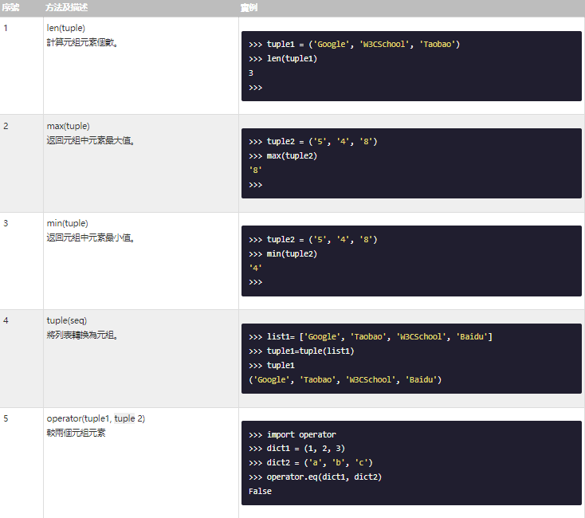

[來源](https://www.w3cschool.cn/python3/)  

## Python3 元組  

Python 的元組（tuple，簡寫為tup）與列表類似，不同之處在於元組的元素不能修改。

元組使用小括號​()​，列表使用方括號​[]​。

元組創建很簡單，只需要在括號中添加元素，並使用逗號隔開即可。

如下實例：
```
tup1 = ('d1','d2','d3','d4')
tup2 = ('1996','2000','2012','2023')
tup3 = '1','2','3','4'
tup4 = ()
tup5 = (99,)
print(type(tup3))
print(type(tup4))
print(type(tup5))

```
運行結果：
```
<class 'tuple'>
<class 'tuple'>
<class 'tuple'>
```

(index.py)

---
## 訪問元組
元組可以使用下標索引來訪問元組中的值，如下實例:
```
tup1 = ('d1','d2','d3','d4')
tup2 = ('1996','2000','2012','2023')

print ("tup1[0]: ", tup1[0])
print ("tup2[1:5]: ", tup2[1:5])
```
運行結果：
```
tup1[0]:  d1
tup2[1:5]:  ('2000', '2012', '2023')

```
(index.py)

---

## 修改元組

元組中的元素值是不允許修改的，但我們可以對元組進行連接組合，如下實例:

```
tupn1 = ('order','66')
tupn2 = ('star','war')
tupn3 = tupn1+tupn2

print(tupn3)

```
運行結果：

```
('order', '66', 'star', 'war')

```
(index.py)

---

## 元組內置函數
Python 元組包含了以下內置函數



---


## 關於元組是不可變的
所謂元組的不可變指的是元組所指向的內存中的內容不可變。

```
tup66 = ('s','t','a','r','w','a','r','s')
tup66[0] = 'S'


Traceback (most recent call last):
    tup66[0] = 'S'
    ~~~~~^^^
TypeError: 'tuple' object does not support item assignment

```

從以上實例可以看出，重新賦值的元組tup，綁定到新的對象了，不是修改了原來的對象。

---