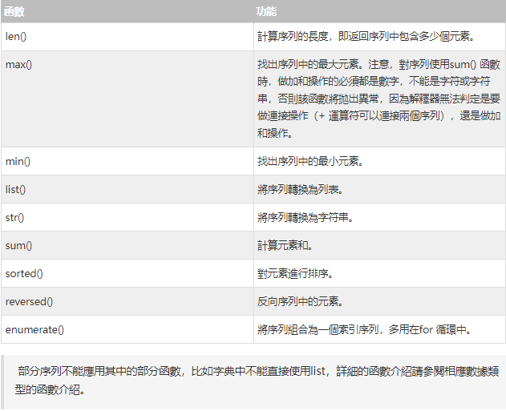

[來源](https://www.w3cschool.cn/python3/) 

##  Python3 序列  
在編程語言中，將以某種方式（比如通過編號）組合起來的數據元素（如數字，字符串乃至其他數據結構）集合稱為數據結構。在python中，最基本的數據結構為序列（sequence，簡寫為seq）。

所謂序列，指的是一塊可存放多個值的連續內存空間，這些值按一定順序排列，可通過每個值所在位置的編號（稱為索引）訪問它們。

為了更形象的認識序列，可以將它看做是一家旅店，那麼店中的每個房間就如同序列存儲數據的一個個內存空間，每個房間所特有的房間號就相當於索引值。也就是說，通過房間號（索引）我們可以找到這家旅店（序列）中的每個房間（內存空間）。

在 Python 中，​​序列類型包括字符串、列表、元組、集合和字典​​，這些序列支持以下幾種通用的操作，但比較特殊的是，集合和字典不支持索引、切片、相加和相乘操作。

字符串也是一種常見的序列（所以以下的例子以字符串作為），它也可以直接通過索引訪問字符串內的字符。

## 序列索引

序列中，每個元素都有屬於自己的編號（索引）。從起始元素開始，索引值從0 開始遞增，如圖1 所示。


除此之外，Python 還支持索引值是負數，此類索引是從右向左計數，換句話說，從最後一個元素開始計數，從索引值-1 開始，如圖2 所示。

無論是採用正索引值，還是負索引值，都可以訪問序列中的任何元素。以字符串為例

```
str = "python"
print(str[0],"==",str[-6])
print(str[5],"==",str[-1])
```
(index.py)

---

## 序列切片

切片操作是訪問序列中元素的另一種方法，它可以訪問一定範圍內的元素，通過切片操作，可以生成一個新的序列。
序列實現切片操作的語法格式如下：
```
sname[start : end : step]
```
其中，各個參數的含義分別是：  

- sname：表示序列的名稱；  
- start：表示切片的開始索引位置（包括該位置），此參數也可以不指定，會默認為0，也就是從序列的開頭進行切片；  
- end：表示切片的結束索引位置（不包括該位置），如果不指定，則默認為序列的長度；  
- step：表示在切片過程中，隔幾個存儲位置（包含當前位置）取一次元素，也就是說，如果step 的值大於1，則在進行切片去序列元素時，會“跳躍式”的取元素。如果省略設置step 的值，則最後一個冒號就可以省略。  

例如，對字符串“python”進行切片：
```
str = "python"
#取索引區間為[0,2]之間（不包括索引2處的字符）的字符串
print(str[:2])
#隔 1 個字符取一個字符，區間是整個字符串
print(str[::2])
#取整個字符串，此時 [] 中只需一個冒號即可
print(str[:])

```
運行結果為：
```
py
pto
python
```
---
## 序列相加

Python 中，支持兩種類型相同的序列使用“+”運算符做相加操作，它會將兩個序列進行連接，但不會去除重複的元素。
這裡所說的“類型相同”，指的是“+”運算符的兩側序列要么都是列表類型，要么都是元組類型，要么都是字符串。

例如，前面章節中我們已經實現用“+”運算符連接2 個（甚至多個）字符串，如下所示：  

```
str1 = "py"
str2 = "th"
str3 = "on"

print(" : ",str1+str2+str3)

```
  
序列相關的內置函數



這裡給大家給幾個例子：
```
str4 = "python-django"
#找出最大的字符
print(max(str4))
#找出最小的字符
print(min(str4))
#對字符串中的元素進行排序
print(sorted(str4))
```
輸出結果為：
```
y
a
['a', 'd', 'g', 'h', 'j', 'n', 'n', 'o', 'o', 'p', 't', 'y']

```

---