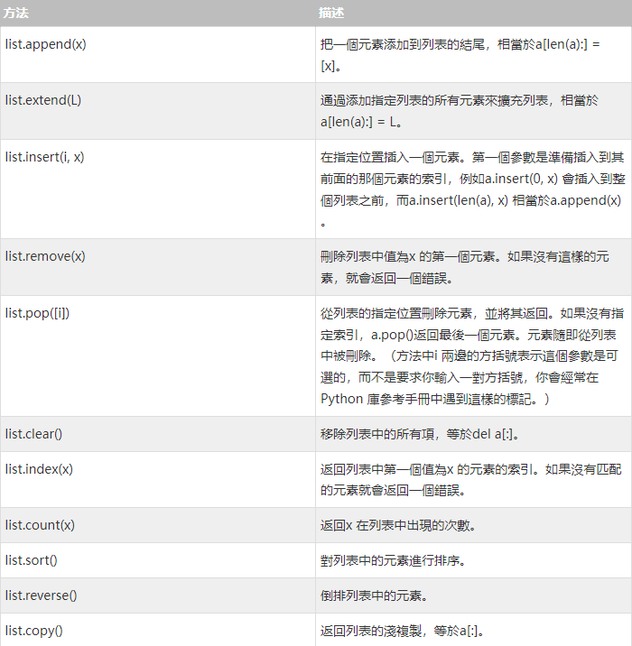

[來源](https://www.w3cschool.cn/python3/)  

## Python3數據結構

---

## 列表  
Python 中列表是可變的，這是它區別於字符串和元組的最重要的特點，一句話概括即：列表可以修改，而字符串和元組不能修改。
以下是Python 中列表的方法：  

下面示例演示了列表的大部分方法：
```
a = [66.25, 333, 333, 1, 1234.5]
print(a.count(333), a.count(66.25), a.count('x'))
a.insert(2, -1)
a.append(333)

print(a)
print( a.index(333) )

a.remove(333)
print(a)

a.reverse()
print(a)

a.sort()
print(a)

```
(index.py)
注意：類似insert, remove 或sort 等修改列表的方法沒有返回值。

---
## 將列表當做堆棧使用

列表的方法使得列表可以很方便的作為一個堆棧來使用，堆棧作為特定的數據結構，最先進入的元素會最後一個被釋放（後進先出）。用append() 方法可以把一個元素添加到堆棧頂。用不指定索引的pop() 方法可以把一個元素從堆棧頂釋放出來。例如：

```
stack = [3, 4, 5]
stack.append(6)
stack.append(7)

print(stack)

stack.pop()
print(stack.pop())
print(stack)

stack.pop()
print(stack.pop())
print(stack)


stack.pop()
print(stack.pop())
print(stack)


print(stack)

```

---

## 列表推導式

列表推導式提供了從序列創建列表的簡單途徑。通常應用程序將一些操作應用於某個序列的每個元素，用其獲得的結果作為生成新列表的元素，或者根據確定的判定條件創建子序列。

每個列表推導式都在for 之後跟一個表達式，然後有零到多個for 或if 子句。返回結果是一個根據表達從其後的for 和if 上下文環境中生成出來的列表。如果希望表達式推導出一個元組，就必須使用括號。


語法格式：
```
結果值1 if 判斷條件 else 結果2  for 變量名 in 原列表
```

這裡我們將列表中每個數值乘三，獲得一個新的列表：

```
vec = [2, 4, 6]
vec2 = [3*x for x in vec]
print(vec2)
```

這裡我們對序列裡每一個元素逐個調用某方法：
```
freshfruit = ['  banana', '  loganberry ', 'passion fruit  ']
freshfruit2 = [weapon.strip() for weapon in freshfruit]

print(freshfruit2)
```

---
## 嵌套列表解析  
Python 的列表還可以嵌套。
以下實例展示了3 * 4 的矩陣列表：
```
matrix = [
    [1, 2, 3, 4],
    [5, 6, 7, 8],
    [9, 10, 11, 12],
]
以下實例將3 * 4 的矩陣列表轉換為4 * 3 列表：

#兩個方法

list1 = [[row[i] for row in matrix] for i in range(4)]
print(list1)


transposed = []
for i in range(4):
     transposed.append([row[i] for row in matrix])

print(transposed)
```
---

## 元組和序列  
元組由若干逗號分隔的值組成，例如：
```
t = 12345, 54321, 'hello!'

print(t[0])
print(t)

# tuples
u = t, (1, 2, 3, 4, 5)

print(u)
```
如你所見，元組在輸出時總是有括號的，以便於正確表達嵌套結構。在輸入時可能有或沒有括號， 不過括號通常是必須的（如果元組是更大的表達式的一部分）。

---

## 集合  
集合是一個無序不重複元素的集。基本功能包括關係測試和消除重複元素。

可以用大括號({}) 創建集合。注意：如果要創建一個空集合，你必須用set() 而不是{} ；後者創建一個空的字典，下一節我們會介紹這個數據結構。

以下是一個簡單的演示：

```
basket = {'apple', 'orange', 'apple', 'pear', 'orange', 'banana'}

print(basket)
print('orange' in basket )
print( 'crabgrass' in basket )

a = set('abracadabra')
b = set('alacazam')

print(a)
print(a - b  )
print(a | b )
print(a & b)
print(a ^ b  )


aa = {x for x in 'abracadabra' if x not in 'abc'}

print(aa)
```

## 字典  
另一個非常有用的Python 內建數據類型是字典。

序列是以連續的整數為索引，與此不同的是，字典以關鍵字為索引，關鍵字可以是任意不可變類型，通常用字符串或數值。

理解字典的最佳方式是把它看做無序的鍵=> 值對集合。在同一個字典之內，關鍵字必須是互不相同。

一對大括號創建一個空的字典：{}。

這是一個字典運用的簡單例子：

```
tel = {'jack': 4098, 'sape': 4139}
tel['guido'] = 4127
print(tel)

print(tel['jack'])

del tel['sape']
tel['irv'] = 4127
print(tel)

print(list(tel.keys()))

print(sorted(tel.keys()))

print('guido' in tel)
print('jack' not in tel)

#構造函數dict() 直接從鍵值對元組列表中構建字典。如果有固定的模式，列表推導式指定特定的鍵值對：

ccc = dict([('sape', 4139), ('guido', 4127), ('jack', 4098)])

print(ccc)
# 字典推導可以用來創建任意鍵和值的表達式詞典：
bbb = {x: x**2 for x in (2, 4, 6)}
print(bbb)
#如果關鍵字只是簡單的字符串，使用關鍵字參數指定鍵值對有時候更方便：

aaa = dict(sape=4139, guido=4127, jack=4098)


```

(index.py)

---