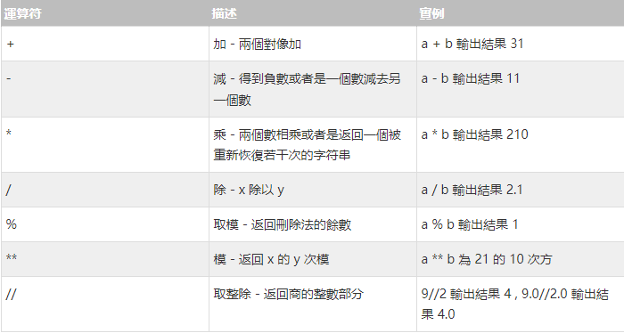
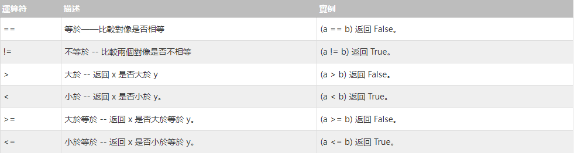
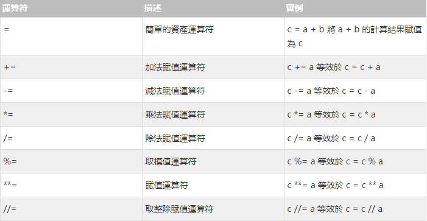
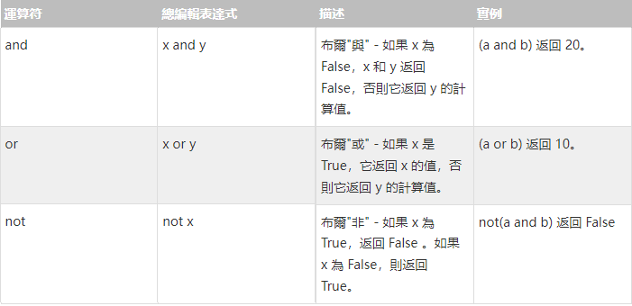
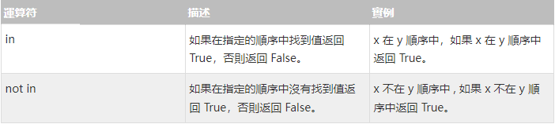
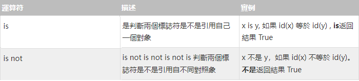
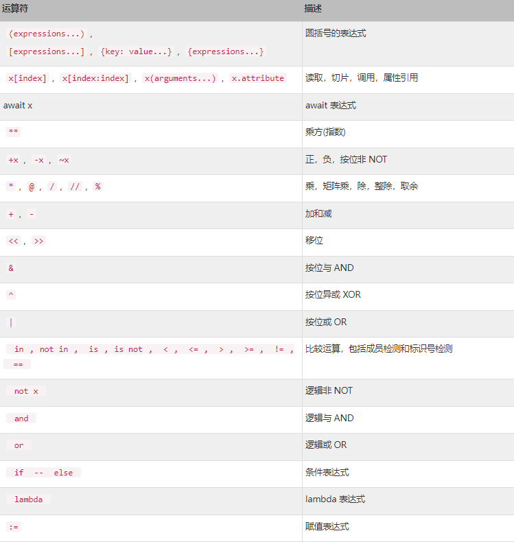

[來源](https://www.w3cschool.cn/python3/)  
## Python3 運算符  

Python的運算符。舉個簡單的例子4 + 5 = 9。例子中，4和5被稱為運算符，" + "稱為運算符。
Python語言支持以下類型的運算符：  
- 算術運算符
- 比較（關係）運算符
- 賦值運算符
- 總編輯運算符
- 成員運算符
- 身分運算符
- 運算符優先級  
---

Python 算術運算符  
下面假設變量a為21，變量b為10：  

下面實例演示了Python所有運算符的操作：
```
a = 21
b = 10
c = 0

c = a + b
print ("a+b 的值為：", c)

c = a - b
print ("a-b 的值為：", c)

c = a * b
print ("a*b 的值為：", c)

c = a / b
print ("a/b 的值為：", c)

c = a % b
print ("a%b 的值為：", c)

aa = 2
bb = 3
cc = aa**bb 
print ("aa**bb 的值為：", cc)

aaa = 10
bbb = 5
ccc = aaa//bbb 
print ("aaa//bbb 的值為：", ccc)
```
以上實例輸出結果：  
```
a+b 的值為： 31

a-b 的值為： 11

a*b 的值為： 210

a/b 的值為： 2.1

a%b 的值為： 1

aa**bb 的值為： 8

aaa//bbb 的值為： 2
```
(index.py)

---

## Python 比較運算符  

下面假設變量a為10，變量b為20：

所有比較運算符返回 1 表示真，返回 0 表示假。這個分別與特殊的變化量 True 和 False 等價。注意：True 和 False 的首字母為大寫。 

下面實例演示了Python所有比較運符的操作：  
```
a = 21
b = 10
c = 0

if ( a == b ):
    print ("a 等於 b")
else:
    print ("a 不等於 b")

if ( a != b ):
    print ("a 不等於 b")
else:
    print ("a 等於 b")

if ( a < b ):
    print ("a 小於 b")
else:
    print ("a 大於等於 b")

if ( a > b ):
    print ("a 大於 b")
else:
    print ("a 小於等於 b")


aa = 5;
ba = 20;
if ( aa <= bb ):
    print ("aa 小於等於 bb")
else:
    print ("aa 大於  bb")

if ( aa >= bb ):
    print ("aa 大於等於 bb")
else:
    print ("aa 小於 bb")
```
以上實例輸出結果：
```
a 不等於 b

a 不等於 b

a 大於等於 b

a 大於 b

aa 小於等於 bb

aa 小於 bb
```
(index1.py)
---
## Python 賦值運算符  

下面假設變量a為10，變量b為20：  
  
以下實例演示了 Python 所有賦值運算符的操作：  
```
a = 21
b = 10
c = 0

c = a + b
print ("1 - c 的值為：", c)

c += a
print ("2 - c 的值為：", c)

c *= a
print ("3 - c 的值為：", c)

c /= a 
print ("4 - c 的值為：", c)

c = 2
c %= a
print ("5 - c 的值為：", c)

c **= a
print ("6 - c 的值為：", c)

c //= a
print ("7 - c 的值為：", c)
```  
以上實例輸出結果：
```
1 - c 的值為： 31
2 - c 的值為： 52
3 - c 的值為： 1092
4 - c 的值為： 52.0
5 - c 的值為： 2
6 - c 的值為： 2097152
7 - c 的值為： 99864
```
(index2.py)

---
## Python 總編輯算符

Python 語言支持總編輯運算符，以下假設置量 a 為 10，b 為 20：

以上實例輸出結果：
```
a = 10
b = 20

if ( a and b ):
    print ("1 - 變量 a 和 b 都為 true")
else:
    print ("1 - 變量 a 和 b 有一個不為 true")

if ( a or b ):
    print ("2 - 變量 a 和 b 都為 true，或其中一個變量為 true")
else:
    print ("2 - 變量 a 和 b 都不為 true")

# 修改變量 a 的值
a = 0
if ( a and b ):
    print ("3 - 變量 a 和 b 都為 true")
else:
    print ("3 - 變量 a 和 b 有一個不為 true")

if ( a or b ):
    print ("4 - 變量 a 和 b 都為 true，或其中一個變量為 true")
else:
    print ("4 - 變量 a 和 b 都不為 true")

if not( a and b ):
    print ("5 - 變量 a 和 b 都為 false，或其中一個變量為 false")
else:
    print ("5 - 變量 a 和 b 都為 true")
```
以上實例輸出結果：
```
1 - 變量 a 和 b 都為 true
2 - 變量 a 和 b 都為 true，或其中一個變量為 true
3 - 變量 a 和 b 有一個不為 true
4 - 變量 a 和 b 都為 true，或其中一個變量為 true
5 - 變量 a 和 b 都為 false，或其中一個變量為 false
```
(index3.py)  

---
## Python 成員運算符

除了以上的一些運算符之外，Python還支持成員運算符，測試實例中包含了一系列的成員，包含字符串，列表或元組。  
  
下面實例演示了Python所有成員運算符的操作：
```
a = 10
b = 20
list = [1, 2, 3, 4, 5 ];

if ( a in list ):
    print ("1 - 變量 a 在給定的列表中 list 中")
else:
    print ("1 - 變量 a 不在給定的列表中 list 中")

if ( b not in list ):
    print ("2 - 變量 b 不在給定的列表中 list 中")
else:
    print ("2 - 變量 b 在給定的列表中 list 中")

# 修改變量 a 的值
a = 2
if ( a in list ):
    print ("3 - 變量 a 在給定的列表中 list 中")
else:
    print ("3 - 變量 a 不在給定的列表中 list 中")
```
以上實例輸出結果：
```
1 - 變量 a 不在給定的列表中 list 中
2 - 變量 b 不在給定的列表中 list 中
3 - 變量 a 在給定的列表中 list 中
```
(index4.py)

---
## Python 身分運算符  
身體運算符用於比較兩個對象的存貯單位
  
以下實例演示了 Python 的所有運算符的操作：
```
a = 20
b = 20

if ( a is b ):
    print ("1 - a 和 b 有相同的標識")
else:
    print ("1 - a 和 b 沒有相同的標識")

if ( id(a) == id(b) ):
    print ("2 - a 和 b 有相同的標識")
else:
    print ("2 - a 和 b 沒有相同的標識")

# 修改變量 b 的值
b = 30
if ( a is b ):
    print ("3 - a 和 b 有相同的標識")
else:
    print ("3 - a 和 b 沒有相同的標識")

if ( a is not b ):
    print ("4 - a 和 b 沒有相同的標識")
else:
    print ("4 - a 和 b 有相同的標識")
```
以上實例輸出結果：
```
1 - a 和 b 有相同的標識
2 - a 和 b 有相同的標識
3 - a 和 b 沒有相同的標識
4 - a 和 b 沒有相同的標識
```
(index5.py)  

---

## Python 運算符優先級  
以下表格列出了從最高到最低優先級的所有運算符：
  
下面實例演示了Python所有運算符高級的操作： 
```
a = 20
b = 10
c = 15
d = 5
e = 0

e = (a + b) * c / d       #( 30 * 15 ) / 5
print ("(a + b) * c / d 運算結果為：",  e)

e = ((a + b) * c) / d     # (30 * 15 ) / 5
print ("((a + b) * c) / d 運算結果為：",  e)

e = (a + b) * (c / d);    # (30) * (15/5)
print ("(a + b) * (c / d) 運算結果為：",  e)

e = a + (b * c) / d;      #  20 + (150/5)
print ("a + (b * c) / d 運算結果為：",  e)
```  
以上實例輸出結果：
```
(a + b) * c / d 運算結果為： 90.0
((a + b) * c) / d 運算結果為： 90.0
(a + b) * (c / d) 運算結果為： 90.0
a + (b * c) / d 運算結果為： 50.0
```
(index6.py)  

---